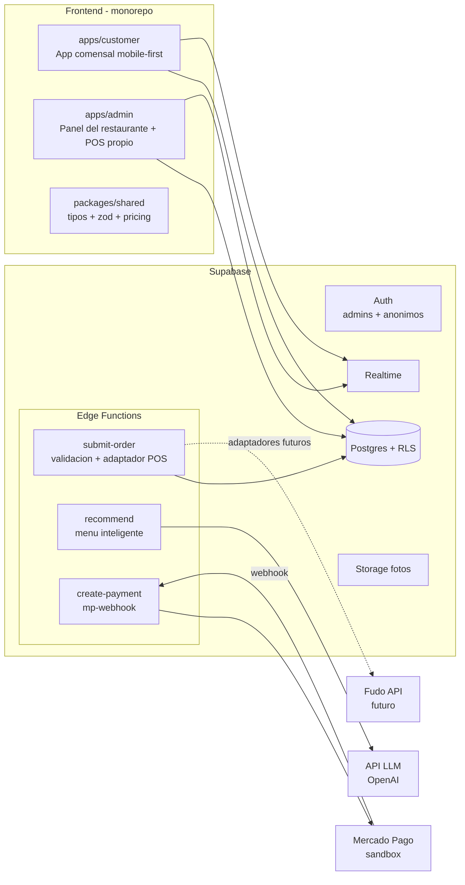

# Plataforma web de autoservicio para restaurantes

## Arquitectura general

La plataforma incluye su **propio POS integrado** (tablero de comandas y gestión de mesas dentro del panel del restaurante). El despacho de pedidos pasa igual por la capa de adaptadores que pide el PDF: el adaptador por defecto es `InternalPosAdapter` (el pedido queda en nuestro POS), y a futuro se agregan `FudoAdapter` y otros sin tocar el núcleo.



## Estructura del monorepo

```
restaurant-platform/
├── apps/
│   ├── customer/            # App del comensal (mobile-first, entra por QR)
│   │   └── src/
│   │       ├── features/    # menu/, product-config/, cart/, session/,
│   │       │                # smart-menu/, orders/, payment/
│   │       ├── components/  # UI compartida de la app
│   │       ├── lib/         # supabase client, query client, helpers
│   │       ├── stores/      # Zustand (carrito local)
│   │       └── routes/      # /:restaurant/:branch/:tableCode, /menu, /cart...
│   └── admin/               # Panel administrativo + POS propio (desktop/tablet)
│       └── src/
│           ├── features/    # restaurant/, tables-qr/, categories/, products/,
│           │                # modifiers/, integrations/,
│           │                # pos/ (tablero de comandas realtime, estados,
│           │                #       mesas activas, cierre de sesión, caja)
│           ├── components/
│           ├── lib/
│           └── routes/
├── packages/
│   └── shared/              # database.types.ts (generado), schemas Zod,
│                            # lógica de precios (base + modificadores), constantes
├── supabase/
│   ├── migrations/          # schema SQL versionado
│   ├── functions/
│   │   ├── submit-order/    # validación + despacho a POS
│   │   ├── recommend/       # menú inteligente (LLM)
│   │   ├── create-payment/  # preferencia de Mercado Pago
│   │   ├── mp-webhook/      # notificaciones de pago
│   │   └── _shared/         # capa de adaptadores POS (internal hoy,
│   │                        # fudo/otros a futuro), cliente LLM, validadores
│   └── seed.sql             # 2 restaurantes demo con menús distintos
├── pnpm-workspace.yaml
└── README.md
```

Dos apps separadas (no una con rutas `/admin`) porque el PDF exige experiencias independientes: la del comensal es mobile-first sin login visible; la admin es desktop con auth por email. Bundles y deploys limpios (dos sitios en Vercel/Netlify).

## Librerías del frontend

- **Vite** + React 18 + TypeScript (ambas apps)
- **React Router v7** (modo librería) — routing
- **TanStack Query** — estado de servidor (menú, sesión, pedidos) con caché e invalidación
- **Zustand** — estado local del carrito (persistido en `localStorage` por sesión de mesa)
- **Tailwind CSS + shadcn/ui** — UI moderna y rápida de construir, mobile-first
- **react-hook-form + Zod** — formularios del admin (productos, modificadores) y del wizard de preferencias
- **@supabase/supabase-js** — DB, auth, realtime, storage
- **qrcode.react** — generación e impresión de QRs por mesa en el admin
- **lucide-react** — íconos

## Modelo de base de datos (Postgres)

Núcleo multi-restaurante y menú configurable:

- `restaurants` (nombre, slug, config) / `branches` / `tables` (número, `qr_token` único, activa)
- `restaurant_members` (user_id ↔ restaurant_id, rol) → base de las políticas RLS del admin
- `menu_categories` (nombre, orden, activa)
- `products` (nombre, descripción, foto, precio base, disponible, info alimentaria, tags dietarios para el LLM: vegetariano/vegano/sin TACC...)
- `product_ingredients` (ingrediente, `is_removable`, disponible) — composición declarada del plato
- `modifier_groups` (nombre, `min_select`, `max_select`, requerido, disponible) — genéricos y reutilizables entre productos
- `modifier_options` (nombre, `price_delta`, disponible; opcionalmente incompatibilidades)
- `product_modifier_groups` (producto ↔ grupo, orden)

Sesiones, pedidos y cuenta (conceptos separados, como pide el PDF):

- `table_sessions` (mesa, estado `open/closed`, abierta/cerrada en; cierre automático al saldar + cierre manual desde el POS)
- `session_participants` (sesión ↔ auth uid anónimo, nombre libre para mostrar)
- `orders` (sesión, participante, estado del ciclo completo gestionado por nuestro POS: `submitted → accepted → in_preparation → ready → delivered`, más `cancelled`; con timestamps por transición para el tablero de comandas)
- `order_items` (producto, cantidad, **snapshot** de nombre y precios al momento del pedido, participante, flag compartido)
- `order_item_modifiers` y `order_item_removed_ingredients` (detalle exacto de la personalización, también con snapshot de precio)
- `payments` (sesión, participante, monto, tipo total/dividido, estado, `mp_payment_id`)

Capa POS (POS propio hoy, externos a futuro):

- `pos_integrations` (restaurante, tipo: `internal` por defecto / `fudo` u otros a futuro, credenciales encriptadas cuando aplique). Con `internal`, el POS es nuestro propio tablero y el pedido no sale de la plataforma.
- `pos_product_mappings` (producto interno ↔ id de producto en el POS externo) — se crea desde el inicio pero solo se usa cuando el restaurante configura un POS externo.
- `integration_logs` (pedido, request/response, error) → visible en el panel admin; para el POS interno registra las transiciones de estado.

RLS: lectura pública del menú por restaurante; datos de sesión accesibles solo a sus participantes; escritura admin solo para miembros del restaurante. La cuenta de la mesa (consumido/pendiente/pagado) se calcula con una vista sobre `orders` + `payments`.

## Edge Functions (la lógica de negocio sensible)

1. **`submit-order`**: recibe el carrito, revalida server-side contra la DB (disponibilidad, precios reales, reglas mín/máx de modificadores, ingredientes removibles), persiste el pedido y lo despacha vía la capa de adaptadores. Interfaz `PosAdapter { sendOrder(order): Result }`: hoy `InternalPosAdapter` (marca el pedido como recibido por nuestro POS y dispara el realtime del tablero de comandas); a futuro `FudoAdapter` y otros. El núcleo nunca conoce al POS concreto (principio 18 del PDF), así que agregar un POS externo es solo escribir un adaptador nuevo y configurar el mapeo de productos.
2. **`recommend`** (menú inteligente): arma un JSON compacto del menú *realmente disponible* (productos, precios, tags, modificadores permitidos), lo envía al LLM junto con las preferencias del grupo (personas, restricciones, presupuesto, ganas de compartir) pidiendo salida estructurada (JSON schema) con 3 propuestas: económica / variada / para compartir. **Valida la respuesta contra la DB**: ids existentes, modificadores permitidos, disponibilidad, presupuesto; si algo no valida, se descarta o reintenta. El LLM nunca inventa productos.
3. **`create-payment`**: calcula el monto según el modo elegido (total, mi consumo + parte de lo compartido, partes iguales, monto custom) y crea la preferencia de Mercado Pago Checkout Pro (sandbox).
4. **`mp-webhook`**: recibe notificaciones de MP, actualiza `payments`, y cuando el saldo llega a cero permite cerrar la `table_session`.

## Flujos clave

- **QR → mesa**: el QR codifica `/{restaurantSlug}/{branch}/{qrToken}`. Al abrir: sign-in anónimo → busca/crea la sesión abierta de esa mesa → se une como participante (pide un nombre) → muestra el menú. Cero pasos extra antes de ver la carta.
- **Mesa compartida en tiempo real**: canal Realtime por sesión; todos ven los pedidos enviados por la mesa y el estado de la cuenta actualizado.
- **Personalización**: pantalla de producto estilo kiosco (McDonald's) renderizada 100% desde datos: ingredientes removibles como toggles, grupos de modificadores como radios/checkboxes según `min/max`, precio recalculado en vivo con la lógica compartida de `packages/shared`.
- **POS propio (tablero de comandas)**: el personal del restaurante ve en tiempo real los pedidos entrantes en un tablero tipo kanban (nuevo → en preparación → listo → entregado), con mesa, ítems, modificaciones y observaciones. También ve las mesas activas con su consumo acumulado y estado de pago, y puede cerrar manualmente una sesión (por ejemplo si la mesa pagó en efectivo o se retiró). Los cambios de estado se reflejan en vivo en la app del comensal.

## Fases de implementación

- **Fase 0 – Setup**: monorepo pnpm, dos apps Vite, proyecto Supabase, CLI + migraciones, CI mínimo (typecheck/lint).
- **Fase 1 – Schema + seed**: todas las tablas, RLS, generación de tipos, seed con 2 restaurantes de rubros distintos (valida la genericidad).
- **Fase 2 – Panel admin**: auth, CRUD de restaurante/sucursales/mesas con QR imprimibles, categorías, productos con fotos, ingredientes y modificadores.
- **Fase 3 – App comensal (menú + carrito)**: entrada por QR, sesión compartida, navegación del menú, personalización de productos, carrito con detalle de modificaciones.
- **Fase 4 – Pedidos**: `submit-order` con validación completa, capa de adaptadores con `InternalPosAdapter`, estados del pedido, realtime en la mesa, vista de cuenta (enviado / en cuenta / pendiente / pagado).
- **Fase 5 – POS propio**: tablero de comandas realtime en el admin (kanban de estados con detalle de modificaciones por ítem), vista de mesas activas con consumo y estado de pago, cierre manual de sesión, historial de pedidos del día.
- **Fase 6 – Menú inteligente**: wizard de preferencias (individual y grupal), edge function `recommend`, pantalla de 3 propuestas editables que se vuelcan al carrito manteniendo control del usuario.
- **Fase 7 – Pagos**: Mercado Pago sandbox, modos de división (todo / lo mío / partes iguales / custom), webhook, cierre de cuenta y de sesión.
- **Fase 8 – Pulido**: disponibilidad en cascada (ingrediente agotado → se refleja en opciones), estados de error, UX mobile, README y guía de demo.

## Trabajo futuro (fuera del alcance inicial, pero previsto en el diseño)

- **Integración con Fudo y otros POS externos**: cuando haya cuenta y credenciales de Fudo, se implementa `FudoAdapter` (auth por apiKey/apiSecret, alta de venta asociada a mesa) más la UI de mapeo producto↔Fudo. La capa de adaptadores, `pos_integrations` y `pos_product_mappings` ya quedan preparadas desde la Fase 1, así que no requiere rediseño: es solo un adaptador nuevo en `supabase/functions/_shared/` y una pantalla de configuración en el admin.
- **Mitades de pizza / combos complejos**: fuera del alcance inicial; el modelo de modificadores cubre la gran mayoría de los casos.

## Decisiones ya tomadas sobre ambigüedades del PDF

1. **POS**: la plataforma tiene su propio POS integrado (tablero de comandas); los pedidos se aceptan y gestionan dentro de la plataforma, sin depender de sistemas externos. Fudo y otros quedan como adaptadores futuros.
2. **Cierre de sesión de mesa**: automático al saldar la cuenta + cierre manual desde el POS propio.
3. **Identificación del participante**: nombre libre al unirse a la sesión (sin registro), suficiente para atribuir consumos y dividir el pago.

### Verificación de Fase 3

Implementación terminada. La migración `20260905180000_customer_sessions.sql` agrega la operación atómica de ingreso por QR y restringe el acceso a sesiones y participantes. El ingreso concurrente por QR y el aislamiento se verificaron contra Supabase local durante la Fase 4. El recorrido visual reproducible está en `docs/SETUP.md`.

### Verificación de Fase 4

Implementación terminada. `20260905200000_orders.sql` agrega confirmación transaccional, snapshots, idempotencia por participante y solicitud, recepción del POS interno, transiciones autorizadas y `session_bills` con RLS. `submit-order` autentica al comensal, valida el contrato compartido y despacha mediante la fábrica de adaptadores. El carrito conserva los envíos pendientes y la mesa ve pedidos y cuenta por Realtime con polling de respaldo.

Se aplicó la migración al stack local y pasaron 28 pruebas HTTP/Realtime, las aserciones SQL transaccionales y 16 pruebas de lógica de frontend/Edge. Se verificaron también tipos, lint y build. Una comprobación en Chrome con viewport móvil cubrió QR, carrito, confirmación, cuenta y recuperación tras respuesta perdida y cierre de sesión, sin duplicar pedidos ni errores de consola. El recorrido completo de aceptación está en `docs/SETUP.md`. El tablero POS de la Fase 5 reemplaza la transición de estados por consola.

### Verificación de Fase 5

Implementación terminada. `20260905220000_internal_pos.sql` agrega `close_table_session` (cierre atómico e idempotente, con el mismo orden de bloqueo que el ingreso por QR) y revoca escrituras directas de sesiones. El panel admin incluye el POS propio: tablero kanban realtime (nuevo → en preparación → listo → entregado) con detalle de modificaciones, mesas activas con cuenta y cierre manual, e historial del día. Los cambios de estado siguen yendo por `transition_order`.

Las aserciones SQL cubren autorización, aislamiento entre restaurantes, idempotencia, conservación de comandas al cerrar y el privilegio de escritura. La suite integrada (32 verificaciones HTTP/Realtime) incluye la consulta anidada del tablero, el cierre por RPC, la denegación a comensales y a otro restaurante, el realtime de cierre y que un nuevo escaneo abre otra sesión. También pasaron typecheck, lint, build y 18 pruebas de lógica. El recorrido de aceptación está en `docs/SETUP.md`. El cobro y el cierre automático al saldar corresponden a la Fase 7.
